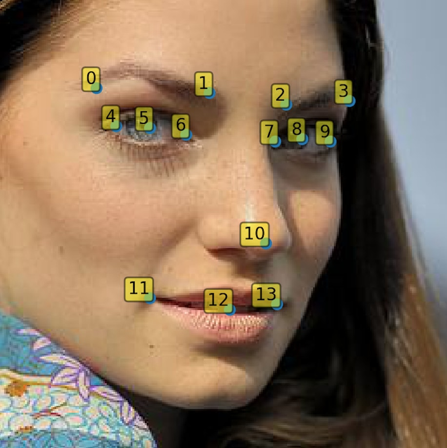
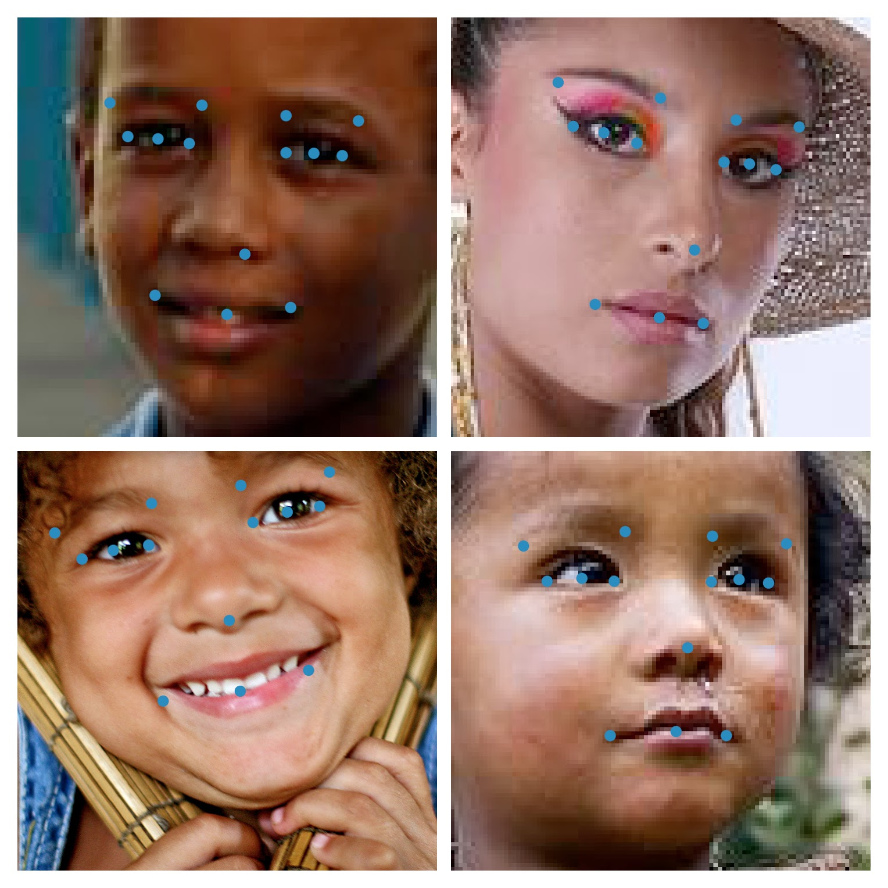

# Facial Keypoints Detection

## Installation
Script is tested on Python 3.6.1. To install required libraries run:

```
pip install -r requirements.txt
```

## Train data
Data is expected to be a set of face photos and CSV file where each row represents coordinates `(xi, yi)` of facial keypoints for image `filename`:

| filename | x0 | y0 | x1 | y1 | ... | x13 | y13 |
|----------|----|----|----|----|-----|-----|-----|

Coordinates are indexed according to the following scheme:



## Pretrained weights
You can use weights from 500 epochs training saved in `weights/conv5_adam_epochs500.hdf5`.  
MSE error on images resized to `(100, 100)` shape is `5.2569`.

## Usage

### Augmenting data
```
$ python app.py augment --help
Usage: app.py augment [OPTIONS] img coords dest

  Augments images stored in IMG folder with coordinates from COORDS csv file
  and saves result in grayscale to DEST folder
```

### Training model
```
$ python app.py train --help  
Usage: app.py train [OPTIONS] img coords model

  Trains model on images from IMG folder with coordinates from COORDS csv
  file and saves trained model in hdf5 file MODEL
```

### Predicting keypoints
```
$ python app.py predict --help
Usage: app.py predict [OPTIONS] img model coords

  Predicts facial keypoints coordinates for images from IMG folder using
  model from file MODEL and saves results in csv file COORDS
```

## Results
These are some examples detected using pretrained weights:


